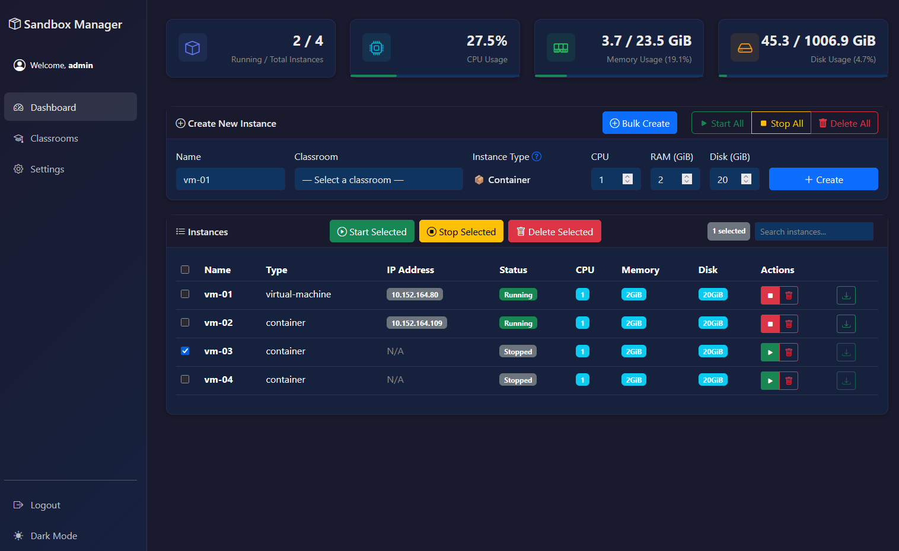

# Sandbox Manager


A web-based interface for managing LXD virtual machines and containers. Designed for classrooms and workshops where you need to quickly create identical VMs for participants and clean them up afterwards.

> [!NOTE]
> Note the [difference between Docker and LXD containers](https://ubuntu.com/blog/lxd-vs-docker).
>
> More often than not, you are better off using just containers. You can create 4-5x more containers than VMs with the same resources. They boot almost instantly and work just like VMs for most purposes.



## Features

- **Classroom Management** - Create reusable configurations with predefined images, LXD profiles, and SSH templates
- **Bulk Instance Creation** - Create multiple instances (VM/Container) at once with pre-flight resource checks
- **One-Click Operations** - Start, stop, or delete all instances in bulk
- **SSH ProxyJump** - Secure SSH access with auto-generated jump user and SSH configs
- **Resource Monitoring** - Real-time CPU, RAM, and disk usage of the host
- **Cloud-init** - Support for [cloud-init](https://docs.cloud-init.io/en/latest/) to customize instance configuration
- **Workshop Ready** - Perfect for training environments with temporary identical VMs/Containers

## Requirements

- Linux host with [LXD installed](https://canonical.com/lxd/install) and configured (`lxd init`)
- Python 3.10+ with `venv` module
- 50GB+ free disk space (depending on instance count)

## Pre-setup

You may want to create at least one instance (both VM and Container) in LXD using either LXD GUI or CLI. For example:

```bash
lxc launch ubuntu:24.04 test-container
lxc launch ubuntu:24.04 test-vm --vm
```

The above commands will download the `ubuntu:24.04` images for both container and VM. You can see only these downloaded images for selection in the Classroom management page.

## Installation

```bash
cd /opt
sudo git clone https://github.com/semanticlib/sandbox.git
sudo chown -R $(whoami):$(whoami) sandbox
cd sandbox
python -m venv .venv
source .venv/bin/activate
pip install -r requirements.txt
cp env.example .env
SECRET_KEY=$(openssl rand -hex 32)
sed -i "s/^SECRET_KEY=.*/SECRET_KEY=$SECRET_KEY/" .env
```

Also update the `HOST_SERVER_IP` variable in `.env` file with your LXD host IP.

**Test run**

```bash
python main.py
```

**Secure Access using SSH Tunnel**

From your local machine, create an SSH Tunnel to access the app.

```bash
ssh -L 8000:localhost:8000 user@<host-ip>
```

Open `http://localhost:8000` in your browser and proceed with the initial setup.

## Production Deployment (Systemd)

To run the application in production using `systemd`, use the following commands:

```bash
export APP_DIR=/opt/sandbox # Adjust if you want to install in a different directory
export APP_USER=$(whoami) # Adjust if you want to run as a different user
sudo tee /etc/systemd/system/sandbox.service > /dev/null <<EOF
[Unit]
Description=Sandbox Manager Application
After=network.target

[Service]
Type=exec
User=${APP_USER}
Group=${APP_USER}
WorkingDirectory=${APP_DIR}
EnvironmentFile=${APP_DIR}/.env

ExecStart=${APP_DIR}/.venv/bin/uvicorn main:app --host \$HOST --port \$PORT
Restart=always
RestartSec=3

# Security hardening
NoNewPrivileges=true
PrivateTmp=true

[Install]
WantedBy=multi-user.target

EOF

sudo systemctl daemon-reload
sudo systemctl enable sandbox
sudo systemctl start sandbox
```

Troubleshoot: Check logs with `sudo journalctl -u sandbox -f` and fix any issues.

> [!IMPORTANT]
> Auth cookies require HTTPS (`secure=True` flag). The login sessions won't persist without HTTPS.
> Point any FQDN to your server and use Caddy for automatic SSL for your domain. See example [Caddyfile](Caddyfile) for reference.

### Create additional admin account

The first admin account is created during initialization. If you need to create a new admin account, you can use the following command:

```bash
sudo ./scripts/create_admin.py
```

## SSH Access & Network Architecture

### Connection Method: SSH ProxyJump

The Sandbox Manager uses **SSH ProxyJump** to provide secure access to guest VMs without requiring direct network exposure or shell access to the LXD host.



**How it works:**

1. The SSH connection jumps through the host machine to reach the guest instance (VM/Container)
2. The Sandbox Manager **automatically generates unique SSH key pairs** for each instance user

A zip file is available for download for each instance (VM/Container), only after a valid instance IP is assigned. The zip file contains:

1. **Private key** - Ed25519 private key
2. **SSH config template** - Pre-configured SSH config with all connection details, including the ProxyJump
3. **Launch server script** - Launch server using `launch-server.bat` script

On Windows, users can directly connect to the instance by running (double-clicking) `launch-server.bat` file.

On Linux, same script can be run from the terminal:
```bash
cd /path/to/downloaded-folder
sh launch-server.bat
```

### No Shell Access on LXD Host

**Important:** Users **do not have shell access** to the LXD host machine. This is by design:

- Users can only access the guest instances (VM/Container) they're authorized to use
- The LXD host remains isolated and secure
- All instance management is done through the web interface
- SSH access is limited to guest instances (via ProxyJump)

This model is ideal for:
- **Classroom environments** - Students get instance access without host access
- **Workshop setups** - Participants can't interfere with host configuration
- **Multi-tenant systems** - Clean separation between host and guest access

### LocalForward: Accessing Applications in Guest Instances (VM/Container)

To access web applications or services running inside guest instances (VM/Container), the SSH connection includes **LocalForward** (local port forwarding).

**How LocalForward works:**

Add `LocalForward` rules in the SSH Config template for each participant in the template (_Settings > Connection Templates_). E.g.,

```config
LocalForward 8080 localhost:80
LocalForward 3000 localhost:3000
```

**After connecting to SSH:**
- Open your browser and navigate to `http://localhost:8080`
- Traffic is securely tunneled through SSH to the instance's port 80
- No need to expose instance ports to the external network

**Common use cases:**
| Service | Local Forward | Instance Port | Access URL |
|---------|---------|---------------|------------|
| Web server default | 8080 | 80 | http://localhost:8080 |
| Custom web app | 3000 | 3000 | http://localhost:3000 |


## Why This is a Secure Model

The Sandbox Manager architecture follows **defense in depth** principles:

**Security benefits:**

| Principle | Implementation |
|-----------|----------------|
| **Minimal Privilege** | Users only access their assigned instances, not the host |
| **Network Isolation** | Instances don't need public IPs or exposed ports |
| **Encrypted Traffic** | All SSH traffic (including LocalForward) is encrypted |
| **No Direct Access** | Host firewall can block direct instance access |
| **Audit Trail** | SSH connections are logged and traceable |
| **Ephemeral Access** | SSH configs can be regenerated/revoked anytime |

**Attack surface comparison:**

| Approach | Host Access | Instance Access | Network Exposure |
|----------|-------------|-----------|------------------|
| **Direct Instance SSH** | ❌ Not needed | ✅ Direct | ⚠️ Instances need public IPs |
| **Bastion Host** | ⚠️ Bastion accessible | ✅ Via bastion | ⚠️ Bastion exposed |
| **ProxyJump (Sandbox)** | ✅ Isolated | ✅ Via jump | ✅ No instance exposure |

**Key security features:**

1. **Host isolation** - LXD host SSH is separate from instance (VM/Container) access
2. **No port forwarding abuse** - LocalForward only forwards to localhost on instance
3. **Credential separation** - Instance credentials independent from host credentials
4. **No persistent tunnels** - Connections close when SSH session ends

## Development

Read the [Contribution Guidelines](CONTRIBUTING.md) for more information on development setup, testing and submitting pull requests.
